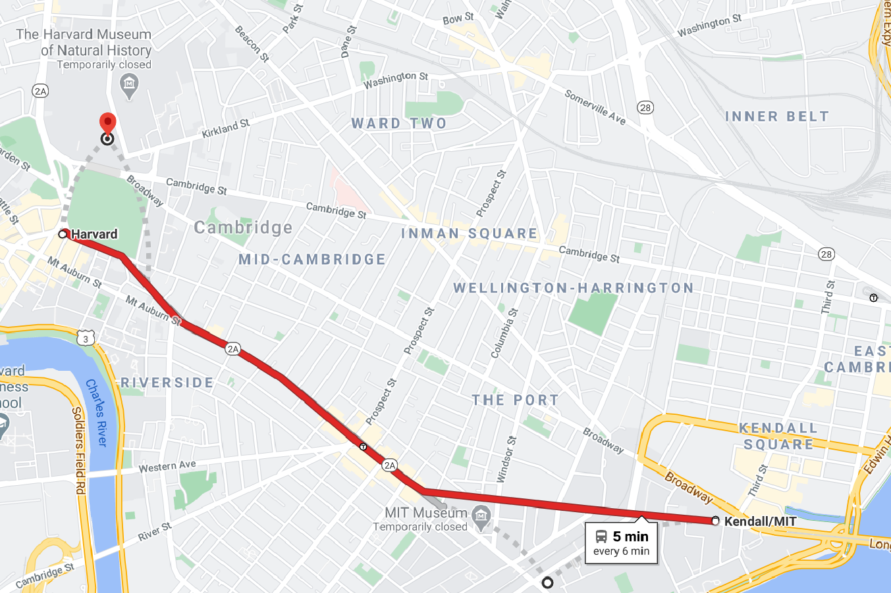

# Real_Time_Bus_Tracker_Exercise
## The goal for this exercise was to bring in a map of Boston and MBTA bus data to show the bus stops in between MIT and Harvard using an animated marker stopping at each location.
# How to Run
## To run through this exercise please fork the files to you local machine. Once you have the HTML, PNG, JS, and CSS files in VS you can drag the HTML file to your browser window.  Once the map has been generated you can click the button in the upper left hand corner of your machine and see the animated icon move across the screen to each bus stop between MIT and Harvard.
# Future Improvements
## There are two primary improvements I would like to make to this exercise.  One would be to insert a bus icon to follow the animated marker across the screen to each stop.  The other improvement I want to make is to have the live bus arrival times appear on a loop as the icon hits each stop.
# License
## Please refer to the "MIT License.txt" file in repo for licensing information.

